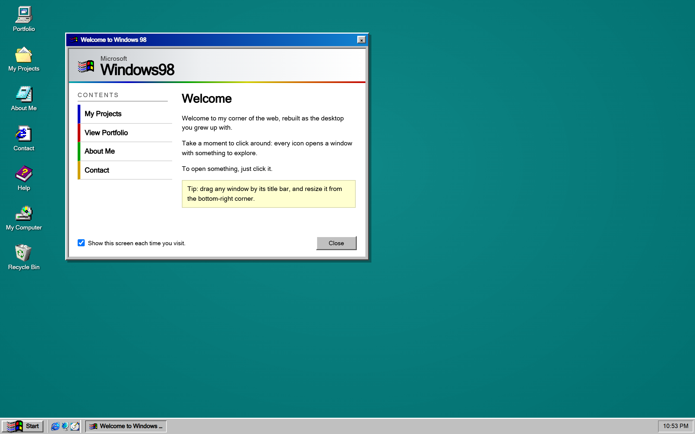

# Windows 98 Portfolio Template

A personal portfolio that boots as a nostalgic Windows 98 desktop: draggable, resizable windows, a Start menu, a taskbar with a live clock, and a "Welcome" dialog. Built with Next.js (static export) and deployed free on GitHub Pages.

You fill in **one file** (`site.config.ts`) and push. No build config to touch, no framework knowledge required.



> Live demo: `https://<your-username>.github.io/<your-repo>` (replace with your own once deployed).

## Features

- One-file content: name, bio, projects, contact links, and section order all live in `site.config.ts`
- Real draggable / resizable / minimizable / maximizable windows, Start menu, taskbar, and system clock
- A Welcome dialog, an in-app Help window, and a classic "Shut Down" screen
- Static export, zero server, free hosting on GitHub Pages
- `basePath` is derived from your repo name automatically by the deploy workflow, so images never 404
- Accessible: keyboard focus rings, reduced-motion support, larger touch targets on phones
- Graceful image fallbacks, no runtime dependencies beyond React and Next

## Quickstart

1. Click **Use this template → Create a new repository** (or clone this repo).
2. Install and run locally:
   ```bash
   npm install
   npm run dev
   ```
   Open http://localhost:3000.
3. Open **`site.config.ts`** and replace the demo content (see below).
4. Commit and push to `main`. Enable Pages once (next section). Done.

## Make it yours (`site.config.ts`)

Everything a visitor sees comes from `site.config.ts`. The demo data belongs to a fictional "Riley Quinn" — replace it.

| What | Where in the config |
|---|---|
| Your name, role, browser tab title, meta description | `identity` |
| The "Welcome" dialog heading, paragraphs, and its shortcut buttons | `welcome` |
| Your bio and skill cards | `about` |
| Your projects (image, blurb, role, result, tags, link) | `projects` |
| Your contact links (email, GitHub, LinkedIn, site) | `contacts` |
| The external-portfolio pointer and résumé link | `portfolio` |
| The in-app Help window (customization guide by default) | `help` |
| The "Shut Down" screen message and sign-off | `shutdown` |
| Desktop wallpaper (image path or CSS value; empty = flat teal) | `theme.wallpaper` |
| Which windows appear and in what order | `sections` |
| Window titles, icons, and opening size/position | `windows` |

Common edits:

- **Add a project:** copy one object in the `projects` array and edit it. Drop its image in `public/` and point `image` at `"/your-file.png"`.
- **Add your résumé:** put a PDF at `public/resume.pdf` (or set `portfolio.resumePath` to an external URL).
- **Hide a window** (e.g. Recycle Bin): remove its key from `sections.desktopIcons` and `sections.startMenu`.
- **Reorder** desktop icons or Start menu: reorder the keys in `sections`.
- **Rename a window:** change its `title` in `windows`.
- **Change an icon:** icons come from [win98icons.alexmeub.com](https://win98icons.alexmeub.com); set any image URL.

Images referenced from config must live in `public/` and be written as root paths (`/foo.png`); they are prefixed with the deploy base path automatically.

## Deploy to GitHub Pages

1. Push your repo to GitHub.
2. **Settings → Pages → Build and deployment → Source: GitHub Actions.**
3. Every push to `main` builds and deploys via `.github/workflows/nextjs.yml`.

The workflow reads your repository name and sets the site's base path for you, so a repo named `my-portfolio` is served correctly at `https://<you>.github.io/my-portfolio/`.

> Deploying to a root `<username>.github.io` repository instead? Set the workflow's base-path step `value` to an empty string.

## Local production build

```bash
npm run build      # outputs a static site to ./out
```

Local builds have no base path (they run at `/`), which is correct for local preview. The base path is only applied in the GitHub Actions deploy.

## Tech stack

Next.js 16 (App Router, static export) · React 19 · TypeScript · Tailwind CSS v4. No UI framework, no database.

## Credits and license

- Icons by [win98icons.alexmeub.com](https://win98icons.alexmeub.com).
- Released under the [MIT License](LICENSE). Update the copyright holder in `LICENSE` to your name.
